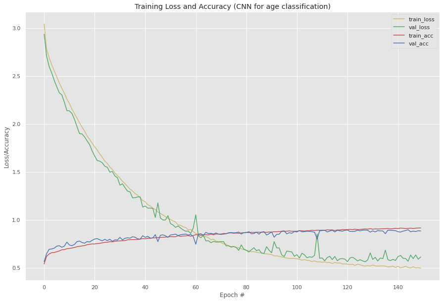

# Age Classification using CNN

## Overview
A Convolutional Neural Network designed from scratch trained using Keras framework that categorizes images of people based on their ages. 
The model categorizes the input image based on three categories- Young , Middle and Old. 

## Dataset
**IMFDB** - Indian Movie Face Database was the dataset used for this project.
IMFDB is a large unconstrained face database consisting of 34512 images of 100 Indian actors collected from more than 100 videos. All the images are manually selected and cropped from the video frames resulting in a high degree of variability interms of scale, pose, expression, illumination, age, resolution, occlusion, and makeup.
url- http://cvit.iiit.ac.in/projects/IMFDB/

## Preprocessing
The following preprocessing was applied to each image:

- Have trained the network on frontal faces images
- Random crops of 64 × 64 pixels from the input image of random sizes
- Randomly mirror images in each forward-backward training pass
- Data Augmentation is used

## Accuracy-Loss Trade-off Graphs

## Libraries Used
1. OpenCV 
2. Keras 
3. Numpy 
4. Pandas 
5. Seaborn 
6. Matplotlib 
7. Pickle 
8. sklearn 
9. imutils 

## Results

Training Accuracy : **93.30%** 
Validation Accuracy : **91.26%** 

## Outputs

## Contributors
-Rohan Limaye: https://github.com/rylp  
-Rohan Naik: https://github.com/rohan-naik07 

