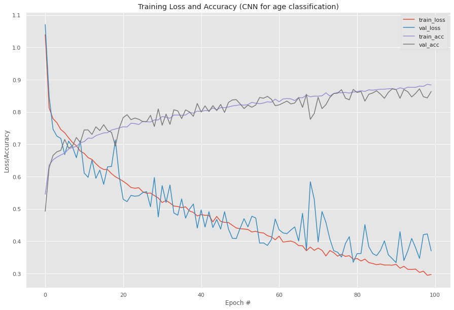
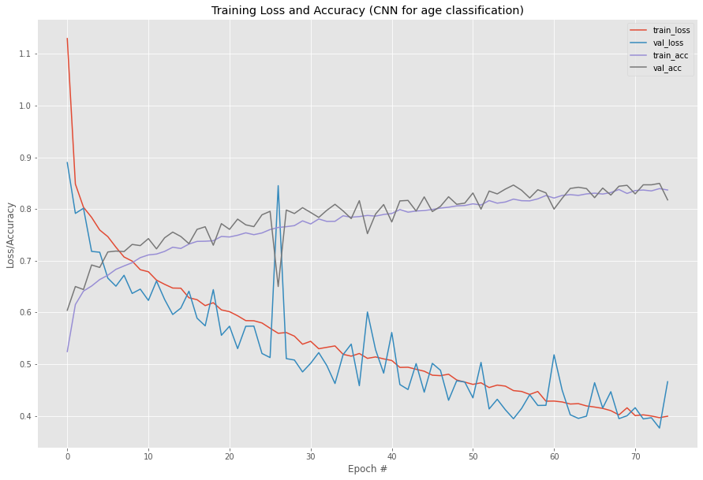
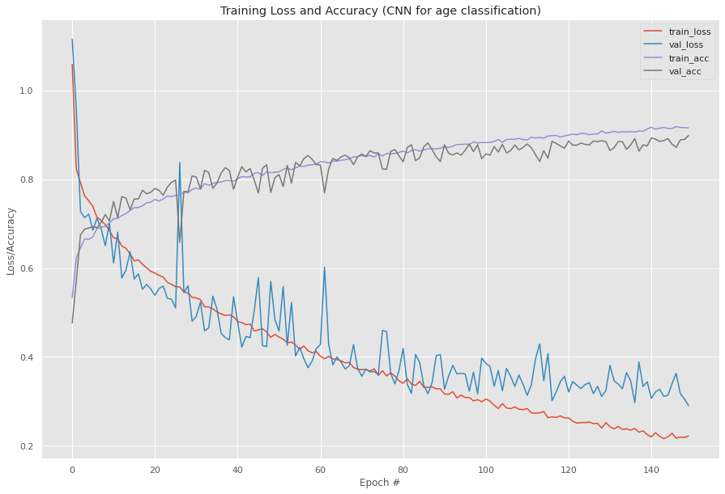
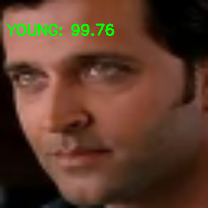
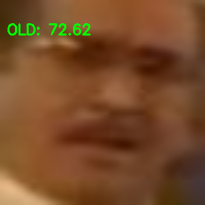
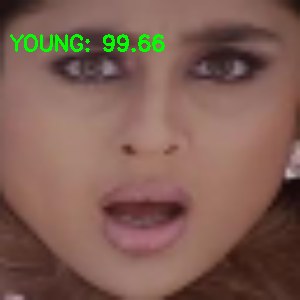
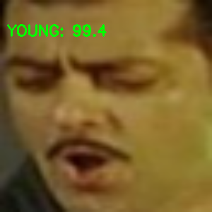
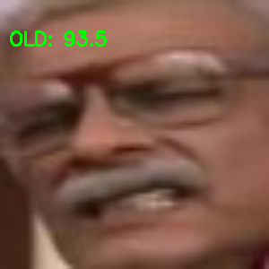

# Age Classification using CNN

## Overview
A Convolutional Neural Network designed from scratch trained using Keras framework that categorizes images of people based on their ages. 
The model categorizes the input image based on three categories- Young , Middle and Old. 

## Dataset
**IMFDB** - Indian Movie Face Database was the dataset used for this project.
IMFDB is a large unconstrained face database consisting of 34512 images of 100 Indian actors collected from more than 100 videos. All the images are manually selected and cropped from the video frames resulting in a high degree of variability interms of scale, pose, expression, illumination, age, resolution, occlusion, and makeup.
url- http://cvit.iiit.ac.in/projects/IMFDB/

## Preprocessing
The following preprocessing was applied to each image:

- Have trained the network on frontal faces images
- Random crops of 64 × 64 pixels from the input image of random sizes
- Randomly mirror images in each forward-backward training pass
- Data Augmentation is used

## Model Description
For **Age Classification**, following are the details of the model: 

1. 3x3 filter shape, 32 feature maps. Stride of 1 and 0 padding. Followed by: ReLU,Batch-Normalization,Max-Pool,Dropout of 0.25
2. 3x3 filter shape, 64 feature maps. Followed by: Batch-Normalization
3. 3x3 filter shape, 64 feature maps,stride 1 and padding 1. ReLU, Batch-Normalization,Max-Pool of size 2,Dropout of 0.25.
4. 3x3 filter shape, 128 feature maps. Followed by: Batch-Normalization
5. 3x3 filter shape, 128 feature maps. Followed by: Batch-Normalization
6. 3x3 filter shape, 128 feature maps,stride 1 and padding 1. ReLU, Batch-Normalization,Max-Pool of size 2,Dropout of 0.25.
7. Fully connected layer of 1024 neurons and the another layer of 84 neurons. Followed by : ReLU,Batch Normalization, Dropout of 0.5. 
8. Last layer maps to the 3 classes for age
  
Trained with a learning rate of 0.025,Batch Size of 64 and with 100 epochs.
Used Stochastic Gradient Descent (SGD) optimizer and 90% split of train and validation data.
Used OpenCV library for image processing along with data visualization and augmentation.

## Libraries Used
1. OpenCV 
2. Keras 
3. Numpy 
4. Pandas 
5. Seaborn 
6. Matplotlib 
7. Pickle 
8. sklearn 
9. imutils 

## Results

Training Accuracy : **93.30%** 
Validation Accuracy : **91.26%** 

## Outputs

## Contributors
-Rohan Limaye: https://github.com/rylp  
-Rohan Naik: https://github.com/rohan-naik07 

